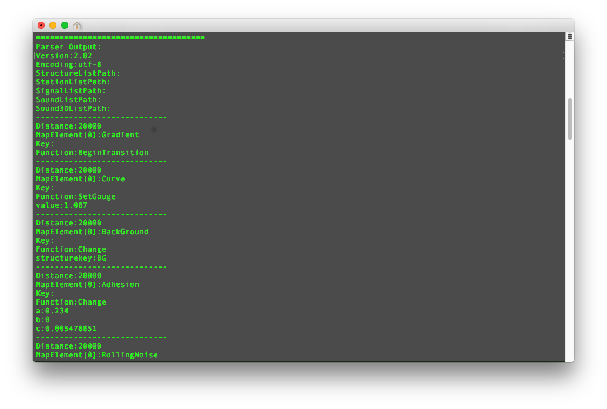

[](https://travis-ci.org/aoisupersix/Bve5_Parsing)
[](https://badge.fury.io/nu/Bve5_Parsing)
[](/License.md)

Bve5_Parsing
===



Bve5構文のC#パーサライブラリです。
Bve5の構文はどのように処理されているのか？という疑問を解消すべく、パーサジェネレータ「ANTLR」を利用し、Bve5.7構文のパーサを実装してみました。現在、Bve5.7.6224.40815の一部構文に対応しています。
特にイレギュラーな入力(引数の数が異なる,構文名が異なる等）に対する処理が本家ソフトウェアと比べてかなり相違があります。

## Supported Syntaxes
- #### Scenario File
    - Bve5.7全構文に対応
    - namespace: **ScenarioGrammar**
    - 出力: **ScenarioDataクラス**
    構文解析の結果は、ScenarioDataクラスで返します。ScenarioDataクラスは以下のフィールドで構成されています。
      - **string Version**: シナリオファイルのバージョン情報
      - **List\<FilePath\> Route**: マップファイルの相対パス
      - **List\<FilePath\> Vehicle**: 車両ファイルの相対パス
      - **string Image**: サムネイル画像の相対パス
      - **string Title**: シナリオタイトル
      - **string RouteTitle**: 路線名
      - **string VehicleTitle**: 車両名
      - **string Author**: 路線と車両の作者
      - **string Comment**: シナリオの説明

    なお、RouteとVechicleに関しては、複数ファイルの指定と重み係数に対応するため、相対パスと重み係数をまとめたFilePath構造体のリストを返します。相対パスは**FilePath.Value**、重み係数は**FilePath.Weight**に対応しています。

    詳しくは、[ScenarioData.cs](/Bve5_Parsing/ScenarioGrammar/ScenarioData.cs)を参照してください。
- #### Map File
    - Bve5.7全構文と変数、一部の古い構文(Legacy構文)に対応
    - namespace: **MapGrammar**
    - 出力: **MapDataクラス**
    構文解析の結果は、MapDataクラスで返します。MapDataクラスは以下のフィールドで構成されています。

      - **string Version**: バージョン情報
      - **string Encoding**: ファイルエンコーディング
      - **string StructureListPath**: ストラクチャリストの相対パス
      - **string StationListPath**: 停車場リストの相対パス
      - **string SignalListPath**: 信号リストの相対パス
      - **string SoundListPath**: サウンドリストの相対パス
      - **string Sound3DListPath**: 固定音源リストの相対パス
      - **List\<SyntaxData\> Statements**: 各構文情報をまとめたSyntaxDataクラスのリスト

    - そのうち、Statementsは各構文情報をまとめたSyntaxDataクラスのリストを返します。SyntaxDataクラスは以下のフィールドで構成されてます。

      - **double Distance**: 構文の距離程
      - **string[] MapElement**: 構文のマップ要素(ex.Structure,Repeaterなど)
      - **string Key**: 構文のキー(Track['この部分'])
      - **string Function**: 構文の関数名(ex.Interpolate)
      - **Dictionary\<string, object\> Arguments**: 構文の引数名。引数がキーであれば型はstring、引数が数値であれば型はdoubleで返します。

    詳しくは、[MapData.cs](/Bve5_Parsing/MapGrammar/MapData.cs)を参照してください

その他は今後作っていきます👍

## Requirements
* [ANTLR4.Runtime(C#)](https://www.nuget.org/packages/Antlr4.Runtime/)
* .Net Standard 2.0で実装しているため、特定のバージョン以降の.Netであれば利用できます。詳しくは[こちら](https://docs.microsoft.com/ja-jp/dotnet/standard/net-standard)を参照して下さい。

## Installation
Nugetから[Bve5_Parsing](https://www.nuget.org/packages/Bve5_Parsing/)をインストールするか、このプロジェクトをビルドしてdllを入手し、各自のプロジェクトにインポートしてください。

## Usage for C\# ##

ex. C#でMapFileの構文解析を行う場合.  

```csharp
using Bve5_Parsing.MapGrammar;

...
    string input; //String to be analyzed
    MapGrammarParser parser = new MapGrammarParser();

    MapData returnData;
    try{
        returnData = parser.Parse(input);
    }catch(Exception e){

    }
...
```

構文が解析された場合、結果は**MapDataクラス**で返ってきます。例えば、ファイルヘッダのバージョン情報は**MapData.Version**に格納されています。

構文解析のエラーは**ErrorListenerクラス**を継承したクラスをパーサのコンストラクタの引数に指定することで取得できます。

## Used Librarys
Bve5_Parsing is using the following library.

#### [ANTLR v4](http://www.antlr.org/index.html)
> The BSD License (3-clause BSD License)
>
> Copyright (c) 2012 Terence Parr and Sam Harwell

* **ライセンス全文 :** [ANTLR4ライセンス全文](/Licenses/ANTLR4.txt)

## License
The MIT License (MIT)

Copyright(c) 2017 aoisupersix

**[License.md](License.md)**

## TechnicalCommentary
Bve5_Parsingの技術解説です。  
-> [TechnicalCommentary.md](TechnicalCommentary.md)
