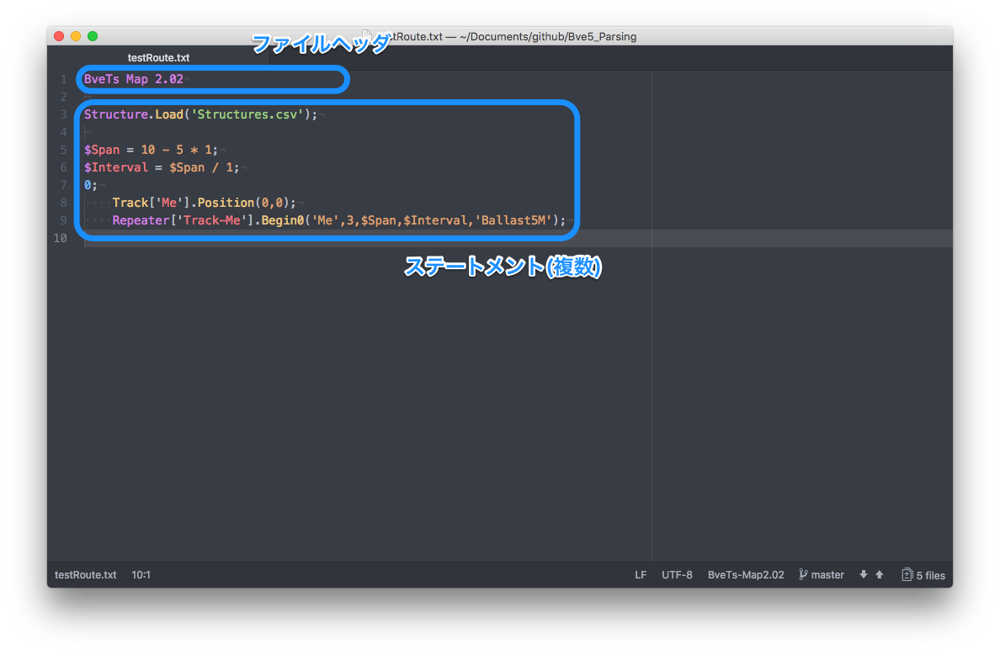

# **Bve5_Parsing 技術解説**
面接の説明用と興味のある人向けのBve5_Parsing解説。

## このライブラリについて
[BveTrainsim5](http://bvets.net/)というソフトウェアのDSL(ドメイン特化言語)に対応したC#用パーサライブラリです。パースの処理にはパーサジェネレータであるANTLR4を利用。

BveTrainsim5とは、フリーの鉄道運転シミュレータで、用意された構文を用いて路線等を作成することが可能。
    →*簡単に言うと、電車でGo!みたいなもの。*

ここでは一番複雑なマップ(路線)ファイル構文のパースについて紹介します。
構文一覧 → [公式サイト](http://bvets.net/jp/edit/)

## マップファイル構文について

* 一つのファイルヘッダと0個以上のステートメントから成るファイル。
* 大文字・小文字の区別はなく、改行も意味を持たない。
* ステートメントは、
  * 現在の距離を表す**距離程**
  * マップを操作する**基本のステートメント**
  * 変数へ値を代入する**代入文**

  の三種類に分けられる。
* ステートメントの終わりには必ず**『;(セミコロン)』**が付く。
* ステートメントの各数値や識別子等には、演算や数学関数、変数が使用可能。
* 文字列は**『'(シングルクォーテーション)』**で囲う。

## パース処理の主な流れ
パースの処理は`MapGrammarParserクラス`の`Parseメソッド`で行っています。→[ソースコードへ](/Bve5_Parsing/MapGrammar/MapGrammarParser.cs#L36-L61)  

処理の流れとしては、  
**字句解析 → 構文解析 → CST(具象構文木)の取得 → AST(抽象構文木)の作成 → ASTの評価**  
となっており、これらの内、字句解析と構文解析は後述の定義よりANTLR4が行ってくれます。
## 字句と構文の定義
字句解析器と構文解析器を生成する元となる、ANTLR4の文法ファイルの定義。
#### 字句解析 [MapGrammarLexer.g4](/Bve5_Parsing/MapGrammar/ANTLR_SyntaxDefinitions/MapGrammarLexer.g4)
  マップファイル構文における字句の定義。
  * 大文字小文字は`fragment`を利用して同一に扱う。 → [fragmentの定義](/Bve5_Parsing/MapGrammar/ANTLR_SyntaxDefinitions/MapGrammarLexer.g4#L108-L134)
  * 空白や改行、コメントなど、無視する字句は`skipアクション`を指定。 → [無視する字句の定義](/Bve5_Parsing/MapGrammar/ANTLR_SyntaxDefinitions/MapGrammarLexer.g4#L136-L137)
  * 文字列は`モード`を利用して定義。 → [文字列の定義](/Bve5_Parsing/MapGrammar/ANTLR_SyntaxDefinitions/MapGrammarLexer.g4#L148-L150)

#### 構文解析 [MapGrammarParser.g4](/Bve5_Parsing/MapGrammar/ANTLR_SyntaxDefinitions/MapGrammarParser.g4)
  先ほどの字句を利用したマップファイル構文の定義。
  * AST作成時に利用する字句にラベルを付けて、各構文を定義する。 → [構文の定義](/Bve5_Parsing/MapGrammar/ANTLR_SyntaxDefinitions/MapGrammarParser.g4#L9-L230)
  * 数式は演算子の優先順位が高い順に定義。 → [数式の定義](/Bve5_Parsing/MapGrammar/ANTLR_SyntaxDefinitions/MapGrammarParser.g4#L232-L258)
  * 変数名や文字列は戻り値を指定し、必要な情報のみを抜き出している。 → [変数名・文字列の定義](/Bve5_Parsing/MapGrammar/ANTLR_SyntaxDefinitions/MapGrammarParser.g4#L260-L270)  

---

以上の定義から、字句解析と構文解析を行い、CSTを作成します。  

この画像はCSTのサンプルです。Eclipseのプラグイン、ANTLR4 IDEを利用して出力したもの。
## ASTの作成
上記のCSTから、必要な要素のみを抜き出したASTを作成します。

画像は、先ほどのCSTから作成したASTのサンプルです。

---

まず、ASTのノードとなるクラスと、　それを継承した各ノードを定義します。 → [AstNodes.cs](/Bve5_Parsing/MapGrammar/AstNodes/AstNodes.cs)  
各ノードには保持する情報と子ノードを定義します。  

続いて、CSTを訪れて必要な情報を抜き出し、ASTを作成します。  
ANTLR4にはCSTをVisitorパターンを利用して巡回する、`MapGrammarParserBaseVisitorクラス`が用意されているので、このクラスを継承した`BuildAstVisitorクラス`でASTを作成します。 → [ソースコードへ](/Bve5_Parsing/MapGrammar/AstNodes/BuildAstVisitor.cs)  

## ASTの評価

Bve5_Parsingでは、パースされた構文は`MapDataクラス`に代入して返します。 → [MapData.cs](/Bve5_Parsing/MapGrammar/MapData.cs)  
その為、ASTを巡回するVisitorクラスを用意し、ASTを評価(つまり`MapDataクラス`に代入)していきます。 → [AstEvaluator.cs](/Bve5_Parsing/MapGrammar/AstEvaluator.cs)
  * AstNodeのデータ構造を表す`AstVisitorクラス`とその処理を記述した`EvaluateMapGrammarVisitorクラス`に分離(ダブルディスパッチ？)。
  * 訪問先は`dynamicキーワード`(動的型付け変数)を利用して、動的に決定。
  * 各構文の距離は`nowDistance変数`で保持する。
  * 変数の代入と利用は、変数の値を管理する`VariableStoreクラス`を介して行う。 → [VariableStore.cs](Bve5_Parsing/MapGrammar/VariableStore)

## 字句解析・構文解析エラーの取得

ANTLR4では、`BaseErrorListenerクラス`をパーサに指定することで、エラーを取得することが出来ます。 → [エラーリスナー指定部分](Bve5_Parsing/MapGrammar/MapGrammarParser.cs#L47)  
`BaseErrorListenerクラス`を継承した`ParseErrorListenerクラス`を作成し、ライブラリの利用側でエラーの取得が出来るようにしました。　→ [ErrorListener.cs](Bve5_Parsing/ErrorListener.cs)

## 実際の動作
